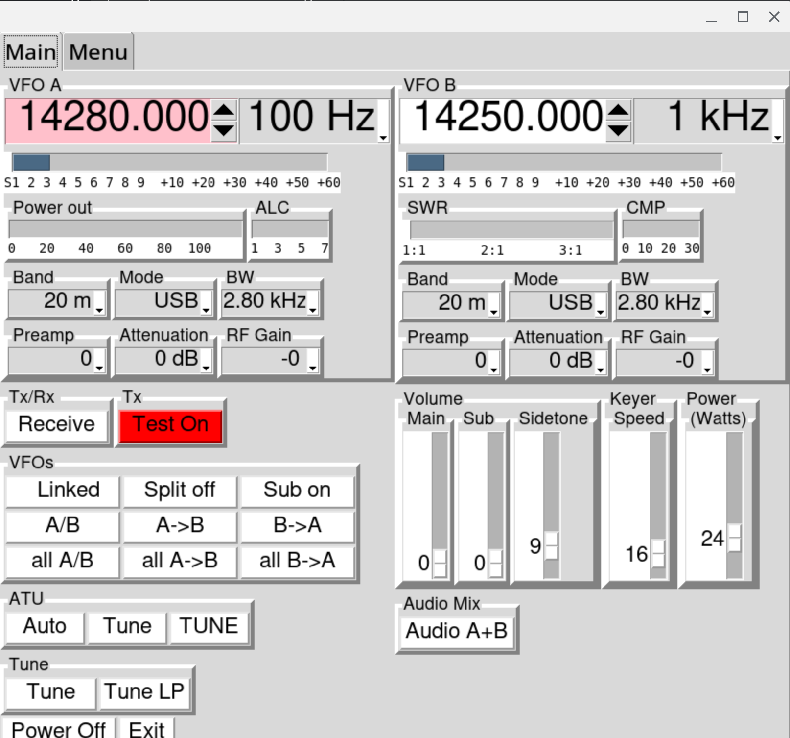

## Program designed to remotely control an Elecraft K4 transceiver

K4-Companion is an application written in python3 that can remotely
control and Elecraft K4 tranceiver via TCP/IP.  It currently controls
the main K4 features and is very useable as is, but new features are
being added all the time.  K4-Companion is very configurable.

The ability to receive audio from the K4 has recently been added.

K4-Companion began life as a simple macro-sending program called
K4Macro-Python, created by Charles Powell, NK8O. It has now grown far
beyond a simple macro-sending program into a full-fledged remote control
program for the K4.

Charles has created a User Manual for it. Check it out
[here](https://github.com/DaleFarnsworth/K4-Companion/blob/main/Documentation/K4%20Companion%20User%20Manual.pdf)

K4-Companion may not be pretty, but it is functional and improving
quickly.

Please send problem reports either: by sending an email, by entering
an issue on github, or by making a pull request. Problem reports and
suggestions are greatly appreciated.

Dale Farnsworth, W7DA
dale@farnsworth.org

